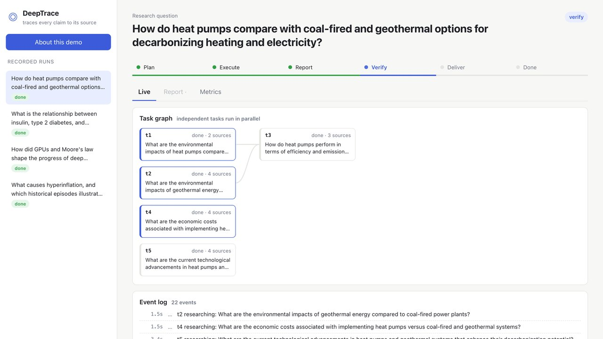
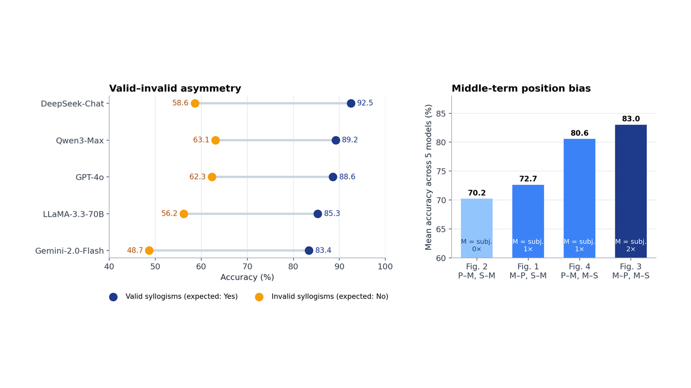

<h1>
  <picture>
    <source media="(prefers-color-scheme: dark)" srcset="assets/logo-dark.svg">
    
  </picture>
  Limeng (Chloe) Ge
</h1>

M.S. student in Computer Science at the **University of Chicago**. I work on how LLMs reason (and where they only pattern-match), LLM post-training, and making what models produce auditable. Before this: a B.A. in philosophy at East China Normal University and an ML engineering internship at SHEIN.

[Website](https://limengge426.github.io) · [Google Scholar](https://scholar.google.com/citations?user=vw06yrsAAAAJ) · [LinkedIn](https://www.linkedin.com/in/limengge0426/) · limengge@uchicago.edu

**Looking for Summer 2027 internships** in ML engineering, LLM post-training, and applied AI.

### Selected projects

<table>
<tr>
<td width="50%" valign="top">

<h4><a href="https://github.com/limengge426/deeptrace-research-agent">DeepTrace</a></h4>
A deep research agent that traces every claim to its source. Crash-safe runs, a judge that checks each citation, and follow-up questions that reuse the evidence. 
Python · FastAPI · LangGraph · Neo4j · React 
<a href="https://limengge426.github.io/deeptrace-research-agent/">Demo</a> · <a href="https://github.com/limengge426/deeptrace-research-agent">Code</a>
</td>
<td width="50%" valign="top">

<h4><a href="https://github.com/limengge426/llm-syllogism">llm-syllogism</a></h4>
Code and benchmark for my AAAI 2026 paper: 11,000 syllogisms show that five frontier LLMs fail in the same places, for the same reasons. 
Python · asyncio · WordNet 
<a href="https://openreview.net/pdf?id=fMIpSy6NVW">Paper</a> · <a href="https://github.com/limengge426/llm-syllogism">Code</a> · <a href="https://limengge426.github.io/lab.html">Try the game</a>
</td>
</tr>
</table>

### Publications

- **Consistent Biases in Large Language Models' Syllogistic Reasoning.** AAAI 2026 Bridge on Logical and Symbolic Reasoning in Language Models. [[paper]](https://openreview.net/pdf?id=fMIpSy6NVW)
- **From Output Quality to Auditability: A Data Mining Agenda for LLM-Generated Artifacts.** With Mingjia Qian. ICDM 2026 BlueSky Track (accepted).

More on [my website](https://limengge426.github.io/research.html).

### Tools I use

        
